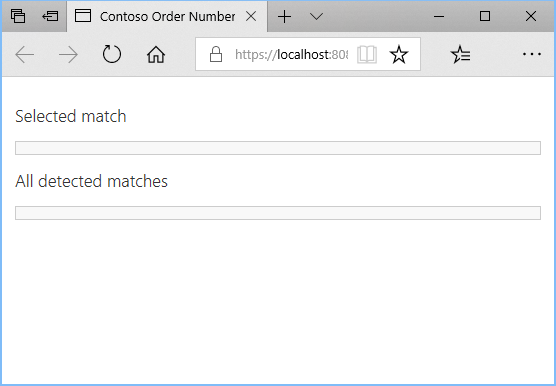
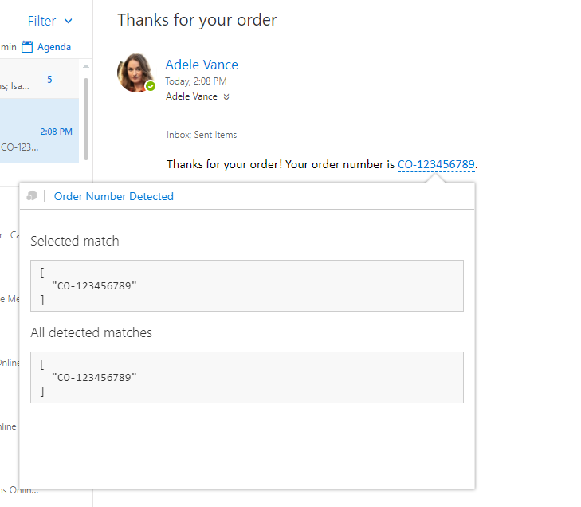

# Outlook Add-in: Contoso Order Number

This sample add-in demonstrates how to create a [contextual add-in](https://docs.microsoft.com/en-us/outlook/add-ins/contextual-outlook-add-ins) that activates when a regular expression match is detected in the body of a message.

The add-in detects fictitious Contoso order numbers with a specific format. The format used is `CO-` followed by 9 digits. When activated, the add-in simply displays both the selected order number and a list of all detected order numbers in the message.

> **Note:** Getting the selected order number relies on an API currently in preview, so it may not be available in all clients. If it is not, the add-in will indicate that it is not supported.

## Prerequisites

In order to try this add-in, you'll need:

- Office 365: If you don't already have Office 365, you can [register for a free 1-month trial](http://office.microsoft.com/en-us/try/?WT%2Eintid1=ODC%5FENUS%5FFX101785584%5FXT104056786).
- An SSL-protected web server: This can be any web server with an SSL certificate trusted by your client. If you don't have access to a web server, see [Running the add-in locally](running-locally.md) for steps to run a basic web server from the command line using Node.js and NPM.

## Configure the add-in

1. Unless you are going to run the add-in locally, copy the HTML, CSS, JavaScript, and PNG files from the project to your web server, maintaining the same directory layout.
1. Open the manifest (`contoso-order-number-manifest.xml`) in a text editor and replace all instances of `https://localhost:8080` with the URL to the directory where you copied the files in the previous step.
1. Verify that you can browse to the updated URLs in your manifest from your client using a browser. For example, you should be able to browse to the URL in the `<bt:Url id="detectedEntityURL">` element in the manifest and see the following page:

    

## Sideload the add-in

Follow the instructions at [Sideload Outlook add-ins for testing](https://docs.microsoft.com/en-us/outlook/add-ins/sideload-outlook-add-ins-for-testing) to sideload the `contoso-order-number-manifest.xml` file.

## Try it out

1. Open [Outlook on the web](https://outlook.office.com).
1. Send yourself a message with a Contoso order number in the body. For example:

    ```
    Thanks for your order! Your order number is CO-123456789.
    ```
1. When the message arrives in your inbox, open it. The order number should be highlighted. Click on the order number to open the add-in.

    

## Contributing

This project welcomes contributions and suggestions.  Most contributions require you to agree to a
Contributor License Agreement (CLA) declaring that you have the right to, and actually do, grant us
the rights to use your contribution. For details, visit https://cla.microsoft.com.

When you submit a pull request, a CLA-bot will automatically determine whether you need to provide
a CLA and decorate the PR appropriately (e.g., label, comment). Simply follow the instructions
provided by the bot. You will only need to do this once across all repos using our CLA.

This project has adopted the [Microsoft Open Source Code of Conduct](https://opensource.microsoft.com/codeofconduct/).
For more information see the [Code of Conduct FAQ](https://opensource.microsoft.com/codeofconduct/faq/) or
contact [opencode@microsoft.com](mailto:opencode@microsoft.com) with any additional questions or comments.

## Copyright

Copyright (c) Microsoft. All rights reserved.